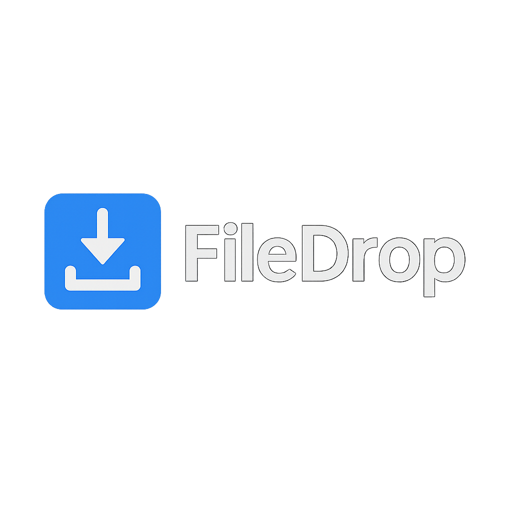

# 📦 FileDrop




**FileDrop** é um sistema web minimalista para **transferência rápida de arquivos** entre dispositivos. Faça upload de um arquivo no seu celular e baixe no seu computador — simples assim.

---

## 🚀 Demonstração

> (Coloque aqui o link para o deploy na Vercel, Netlify ou outro serviço)

---

## ✨ Funcionalidades

- 📤 Upload de múltiplos arquivos direto do navegador
- 📥 Download rápido no mesmo navegador ou em outro dispositivo
- 🗑️ Exclusão manual de arquivos
- 💾 Armazenamento temporário dos arquivos


---

## 🛠️ Tecnologias

- [Next.js](https://nextjs.org)
- [TypeScript](https://www.typescriptlang.org/)
- [Tailwind CSS](https://tailwindcss.com)

---

## ⚠️ Observações

- Os arquivos são armazenados temporariamente em `/tmp`, ou seja:
  - Eles são descartados após alguns minutos de inatividade (em ambientes serverless como Vercel)
  - Útil apenas para transferências rápidas
- Sem autenticação: qualquer um com o link pode ver e baixar os arquivos

---

## 📦 Instalação local

```bash
git clone https://github.com/seu-usuario/filedrop.git
cd filedrop
npm install
npm run dev
```

Acesse: `http://localhost:3000`

